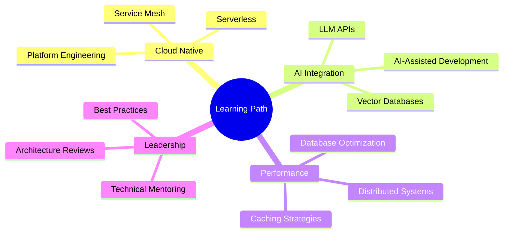

<h1 align="center">
  
</h1>

<div align="center">


[](https://www.linkedin.com/in/mehmetnuri/)
[](mailto:info@mehmetnuri.net)
[](https://github.com/mehmetnuri)

</div>


## 💻 `whoami`


```java
public class Developer {
    String name = "Mehmet Nuri";
    String title = "Principal Software Developer";
    int experienceYears = 11;
}
```

### 🎯 What I Do

- 🔨 **Build Systems That Scale** — From monoliths to microservices, from tens to millions of users
- ⚡ **Optimize Everything** — Performance isn't a feature, it's a requirement
- 🧪 **Test-Driven Development** — If it's not tested, it's broken. Period.
- 📦 **DevOps Automation** — Manual deployments are so 2010
- 🐛 **Debug Like a Detective** — Stack traces are just crime scenes waiting to be solved
- 💡 **Mentor Developers** — Good code is written once, great code is taught

<br clear="right"/>

---

## 🚀 Tech Stack

<details open>
<summary><b>⚙️ Backend Engineering</b></summary>
<br/>

**Languages**
```javascript
const skills = {
  mastery: {
    Java:   "████████████████████ 95%", // Java ecosystem ninja
    Python: "████████████████░░░░ 80%", // Automation & scripting wizard
    Kotlin: "███████████████░░░░░ 75%"  // Modern JVM development
  }
};
```

**Frameworks & Tools**
<p>


</p>

</details>

<details open>
<summary><b>☁️ DevOps & Cloud</b></summary>
<br/>

**Infrastructure**
<p>


</p>

**CI/CD Pipeline**
<p>


</p>

</details>

<details open>
<summary><b>💾 Data & Caching</b></summary>
<br/>

**Databases**
<p>


</p>

</details>

<details open>
<summary><b>🛠️ Development Tools</b></summary>
<br/>

**Build & Package**
<p>


</p>

**Monitoring & Observability**
<p>


</p>

**Operating Systems**
<p>


</p>

</details>

---

## 📊 GitHub Stats

<div align="center">
  
  
</div>

---

### 💡 Daily Toolkit

- **Architecture**: Microservices, Event-Driven, Domain-Driven Design, CQRS
- **Development**: TDD, Clean Code, SOLID Principles, Design Patterns
- **DevOps**: Docker, Kubernetes, GitOps, Infrastructure as Code
- **Databases**: SQL optimization, NoSQL strategies, Caching layers
- **Monitoring**: Observability, Distributed tracing, Performance tuning
- **Collaboration**: Code reviews, Tech specs, Knowledge sharing

---

## 🎯 Core Competencies

<table>
<tr>
<td width="50%">

### 💻 Development

- **Clean Code Advocate**
  - SOLID principles in practice
  - Design patterns that actually help
  - Readable > Clever
  
- **Testing Enthusiast**
  - Unit, Integration, E2E
  - TDD when it makes sense
  - Mocking without going crazy

- **API Design**
  - RESTful best practices
  - GraphQL when needed
  - Versioning strategies

</td>
<td width="50%">

### 🏗️ Architecture

- **Microservices**
  - Service boundaries
  - Inter-service communication
  - Data consistency patterns
  
- **Event-Driven**
  - Kafka, RabbitMQ
  - Event sourcing
  - CQRS patterns

- **Cloud-Native**
  - 12-factor apps
  - Containerization
  - Orchestration strategies

</td>
</tr>
</table>

---

## 🌱 Always Learning



---

## 🎨 Philosophy

<div align="center">

### 💭 Developer Wisdom

```
┌─────────────────────────────────────────────────────────┐
│  "Code is like humor. When you have to explain it,      │
│   it's bad."                                            │
│                                                         │
│  • Write code humans can understand                     │
│  • Test like your job depends on it (it does)           │
│  • Deploy with confidence, not hope                     │
│  • Monitor everything, assume nothing                   │
│  • Refactor before it's too late                        │
│  • Document for your future self                        │
└─────────────────────────────────────────────────────────┘
```

</div>

---

## 🤝 Let's Connect

<div align="center">

**Open for interesting technical discussions, collaborations, and coffee chats (virtual or real)!**

[](https://www.linkedin.com/in/mehmetnuri/)
[](mailto:info@mehmetnuri.net)
[](https://github.com/mehmetnuri)

</div>

---

<div align="center">

### 💡 *"Clean code, observable systems, reproducible builds"*


</div>

---


